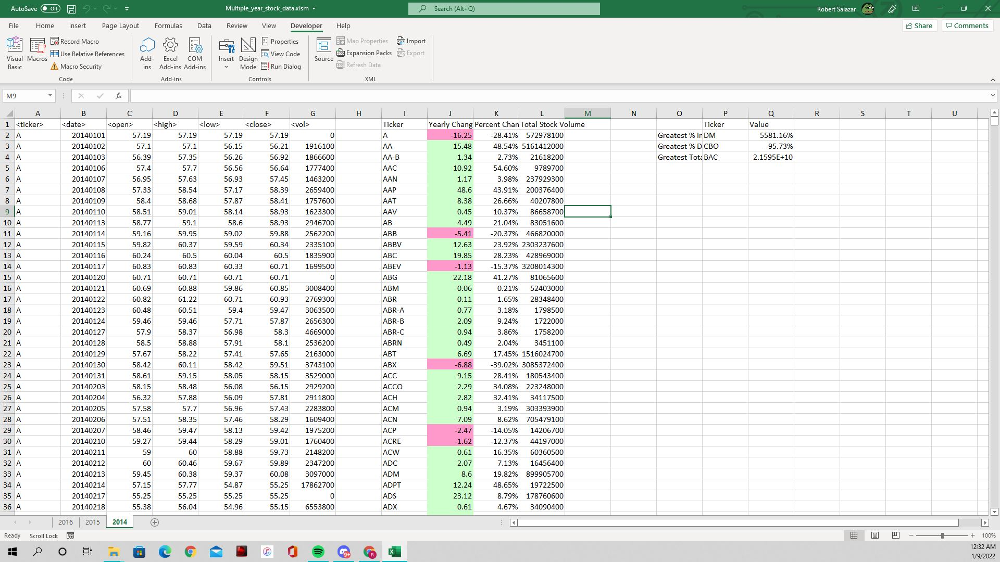
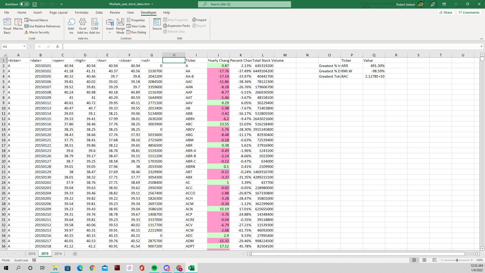
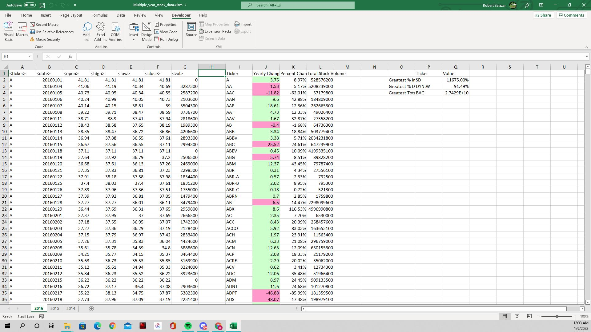

# [VBA](Summary_Table.vb) Homework: The VBA of Wall Street

## Background

You are well on your way to becoming a programmer and Excel master! In this homework assignment, you will use VBA scripting to analyze real stock market data. Depending on your comfort level with VBA, you may choose to challenge yourself with a few of the challenge tasks.

### File

* [Stock Data](https://github.com/RobSalazar/VBA-challenge/blob/main/Multiple_year_stock_data.xlsm) - Run your scripts on this data to generate the final homework report.

### Stock Market Analyst

## Instructions

* Create a script that will loop through all the stocks for one year and output the following information:

  * The ticker symbol.

  * Yearly change from opening price at the beginning of a given year to the closing price at the end of that year.

  * The percent change from opening price at the beginning of a given year to the closing price at the end of that year.

  * The total stock volume of the stock.

* You should also have conditional formatting that will highlight positive change in green and negative change in red.

* The result should look as follows:

## BONUS

* Your solution will also be able to return the stock with the "Greatest % increase", "Greatest % decrease" and "Greatest total volume".
